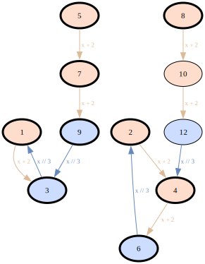

# VisIter

See what a discrete iteration actually does — as a graph.

## The simplest case

Integers 1–9. Rule: divisible by 3 → divide by 3. Everything
else → add 2. Where does each value end up?

```bash
echo 'range(1, 10), [Rule(lambda x: x%3==0, Op(lambda x: x//3))], Op(lambda x: x+2)' | viter
```



One line, auto-derived edge labels, SVG on stdout.

## Install

```bash
pip install visiter
```

Graphviz must be available on `PATH` (`brew install graphviz` /
`apt install graphviz`).

## Going further

Put the iteration in a `.vit` file — shebang-executable, with
comments:

```bash
#!/usr/bin/env viter
# descent graph, range 1–9
range(1, 10),
[Rule(lambda x: x%3==0, Op(lambda x: x//3, label="÷3"))],
Op(lambda x: x+2, label="+2")
```

```bash
chmod +x descent.vit
./descent.vit > descent.svg       # shebang
viter descent.vit -o descent.svg  # explicit
```

Crop the view around a node, render only what reaches it:

```bash
viter descent.vit --render 'anchor=1, radius=8, direction="backward"' -o crop.svg
```

Use the Python API instead of the CLI:

```python
from visiter import iterate, Op, Rule, to_dot

graph = iterate(
    range(1, 10),
    [Rule(lambda x: x % 3 == 0, Op(lambda x: x // 3))],
    Op(lambda x: x + 2),
)
to_dot(graph).render("descent", format="svg")
```

## Two entry points

- **`viter`** — one-shot: `.vit` file (or stdin) in, image out. Safe
  defaults (`--max-nodes 10000`, `--time-limit 00:00:30`) keep a
  typo'd rule from running away. Output goes to stdout or `-o FILE`.
- **`visiter`** — pipe-composable subcommands for full control:

  ```bash
  visiter build descent.vit | visiter to-dot 'anchor=1' | dot -Tsvg > out.svg
  ```

  `build` writes JSON; `to-dot` reads JSON, writes DOT; `validate`
  checks the JSON against the bundled schema; `analyze` bridges to
  [NetworkX](https://networkx.org/) for graph algorithms.

## Why VisIter?

**Free, scriptable, Graphviz-native, Unix-pipe-composable orbit-graph
rendering for discrete iterations under guarded rules** — with cutoff
boundaries (bounds, depth limits, render crops) as a first-class
visual primitive, not silent truncation.

Full honest comparison against NetworkX, NestGraph (Mathematica),
Maude, LoLA, and continuous-dynamics tooling:
**[docs/comparison.md](docs/comparison.md)**.

## Documentation

- [docs/tutorial.md](docs/tutorial.md) — gentle introduction: what
  problem the tool solves, smallest example, what each piece does,
  what the dashed arrows mean. Start here.
- [docs/manual.md](docs/manual.md) — reference: every parameter,
  every data field, the rendering model in full, design decisions.
- [docs/comparison.md](docs/comparison.md) — how VisIter relates to
  other tools in the ecosystem, and when to pick something else.
- [demos/](demos/) — runnable end-to-end examples: `make demo` writes
  SVG/PDF/DOT into `demos/out/`.

## License

MIT
