# VisIter Manual

> **First time here?** This manual is a reference. If you'd rather
> start with motivation, a small example, and a build-up of concepts,
> read [tutorial.md](tutorial.md) first and come back to the manual
> when you need parameter-level detail.

VisIter is a fluent pipeline: `viter(iterable)` starts a `Builder` you
configure with `.case()` / `.cases()` / `.default()`, then terminate
with `.build()` (returns a `Graph`) or `.render()` (one-shot
`build().to_dot().render()`). The `Graph` composes further with
`.to_dot(...)`, `.filter(...)`, `.tap(...)`, and `.write(...)`. Every
stage speaks a documented dict shape, so each can be used standalone.

This manual walks through the data model, semantics, and common
patterns. For the absolute minimum, see [README.md](../README.md).

---

## 1. The Builder API

### `viter(iterable, *, max_depth=64, max_nodes=1024, on_limit="stop", time_limit=None, match=Match.ALL, tags=None, key_type=None, engine="auto", lang="python", consts=None)`

Starts a fluent `Builder` chain. `iterable` seeds the BFS (can be a
single value — an `int`, a `str`, a `tuple`, etc. — or any iterable of
values). All other options are keyword-only and are forwarded to the
internal graph-construction step when the chain is materialized.

- `max_depth` — soft cap on BFS depth (default 64). Nodes at the limit
  are kept but not expanded; any matching case becomes a pseudo-edge.
  Pass `None` to disable.
- `max_nodes` — hard total-node cap (default 1024). Pass `None` to
  disable.
- `on_limit` — `OnLimit.STOP` (default, accepts the string `"stop"`)
  returns the partial graph and emits a warning. `OnLimit.RAISE`
  (`"raise"`) aborts with `RuntimeError`. `max_depth` is always a
  soft topological stop; it never raises.
- `time_limit` — `"hh:mm:ss"` wall-clock cap on the build phase.
- `match` — `Match.ALL` (default) means every case whose condition
  matches fires; `Match.FIRST` short-circuits after the first match.
  Per-case `exclusive=` overrides the mode for individual cases.
- `tags` — optional `dict[str, callable]`. Each callable is a
  predicate on values; nodes where it returns True get that tag in
  their `tags` list. `"highlight"` is the conventional tag for visual
  emphasis.
- `key_type` — optional override for per-node value classification.
  `None` (default) infers from each value's Python type via
  `json_type`. Pass a JSON Schema primitive name (`"null"`,
  `"boolean"`, `"integer"`, `"number"`, `"string"`, `"array"`,
  `"object"`) to fix one type for every node, or a callable
  `value → str | None` to classify per value (returning `None` falls
  back to `json_type`). Useful for domain types that serialize as
  strings but should be treated numerically (`Fraction`, `Decimal`,
  `sympy.Rational`).
- `engine` — BFS backend selection (optional native acceleration; see
  section 8). `"auto"` (default) uses the native engine whenever the
  `visiter_native` extension is installed — it handles the full build,
  `max_depth`/`max_nodes`/`time_limit`/`bound` included — else pure
  Python. `"native"` requires it (raises otherwise); `"python"` forces
  pure Python. The native path produces a byte-identical graph for the
  deterministic limits; `time_limit` is best-effort (the wall-clock cut
  point is non-deterministic, exactly as in pure Python).
- `lang` — callback language (see section 8). `"python"` (default) takes
  Python callables in `.case()`/`.default()`. `"rust"` switches to inline
  Rust expression *strings* (value bound to `s`), compiled on the fly with
  `rustc` and run natively.
- `consts` — only with `lang="rust"`: a `dict[str, int]` of `i64`
  constants the Rust expressions may reference (e.g. `consts={"N": 10}`).

### Builder methods

`.case(condition, fn, *, label=None, id=None, bound=None, exclusive=None)`
adds a guarded case to the chain:

- `condition(x) -> bool` — *applicability*: is this case's `fn` even
  meaningful for this value?
- `fn(x) -> x'` — the operation producing the successor. May return
  either a plain value (the edge is labeled with this case's static
  `label`) or an `OpResult(value, label="…")` to override the edge
  label *for this one call*. `OpResult(value)` and
  `OpResult(value, label=None)` are equivalent and fall back to the
  static label, so a partially-dynamic op can opt out per call without
  switching return shapes.
- `label` — static display string on every edge produced by this case
  (unless `fn` returns an overriding `OpResult`). When omitted, derived
  from `fn`: `fn.__name__` for named functions, the lambda body's
  `ast.unparse` form for lambdas (same-line lambdas are disambiguated
  by bytecode source position). When the source isn't retrievable
  (REPL, `functools.partial`, C extensions) and no `label=` is given,
  a `ValueError` is raised.
- `id` — stable key used by `op_order`, `op_colors` pinning, and JSON
  round-trips. **Defaults to the auto-derived string from `fn` —
  independent of whatever you chose for `label`.** Two cases built
  from the same function share an id even when their display labels
  differ, and color pins don't break when you later rename a label.
  Pass `id=` explicitly for a stable pin target that survives
  refactors, or a shorter custom key, or to split two lambdas whose
  bodies happen to unparse to the same string.
- `bound(x) -> bool`, optional — *structural cutoff*: even if the op
  IS applicable, do we want to stop here? `bound=None` means "no extra
  cutoff". The semantics are:

  | condition | bound      | result                                      |
  | --------- | ---------- | ------------------------------------------- |
  | False     | (any)      | case skipped, nothing recorded              |
  | True      | True/None  | normal edge fires                           |
  | True      | False      | pseudo-edge recorded (rendered as ghost)    |

- `exclusive` — `True` / `False` / `None`. `None` (the default) lets
  the chain-level `match=` mode decide: `Match.ALL` → not exclusive,
  `Match.FIRST` → exclusive. An explicit `True` / `False` overrides
  the mode for this case only. When a matched case is exclusive,
  later cases and the default are skipped for that value.

`.cases(iterable)` adds multiple cases at once. Each item is
`(cond, fn)` or `(cond, fn, kwargs_dict)` where the dict may carry
`label`, `id`, `bound`, `exclusive`. Useful when cases are generated
from data:

```python
cases = [(cond_for(k), fn_for(k), {"label": str(k)}) for k in keys]
viter(start).cases(cases).build()
```

`.default(fn=None, *, label=None, id=None)` sets the fallback op that
fires when no case matched. `default` has the same return-value contract
as `case`: a plain value uses the static `label`, an `OpResult(value,
label=…)` overrides per call. `default` is not a "failure" branch — it
is a regular case without an explicit condition. `.default()` without
arguments (or with `fn=None`) declares values with no matching case as
leaves. Calling `.default()` twice on the same builder raises
`RuntimeError` — defaults are singletons.

`.build()` materializes the chain into a `Graph`. This is where
lambdas are evaluated, rules are registered, and BFS runs.

`.render(format="svg", file=None)` is a one-shot shortcut for
`.build().to_dot().render(format=..., file=...)`. Use when you don't
need `.to_dot()` options — the shortcut only forwards `format` and
`file`.

### Immutability

Builders are immutable: every chain method returns a new Builder, the
original is unchanged. That lets you branch a shared prefix:

```python
base = viter(range(1, 20)).case(lambda x: x % 2 == 0, lambda x: x // 2)
variant_a = base.default(lambda x: x + 1).build()
variant_b = base.default(lambda x: x - 1).build()
```

### `Match` and `OnLimit` enums

```python
from visiter import Match, OnLimit
# Match.ALL (default) | Match.FIRST
# OnLimit.STOP (default) | OnLimit.RAISE
```

Both enums are string-valued, so `Match.FIRST == "first"` and
`OnLimit.STOP == "stop"` — plain strings are accepted everywhere the
enum is expected, which keeps `.vit` files terse and backwards-friendly
with older examples.

---

## 2. Materializing the graph

### Output graph dict

```python
{
    "schema_version": "1",             # always set by .build()
    "roots":         [value, ...],     # starts, in input order
    "nodes":         {str(value): {
                          "depth":    int,        # min BFS hops from any start
                          "key_type": str,        # JSON type: "integer",
                                                  # "string", "array", ...
                          "tags":     [str, ...], # if any tag predicate matched
                      }, ...},
    "edges":         [{"from": A, "to": B, "op": id, "label": str}, ...],
    "pseudo_edges":  [{"from": A,           "op": id, "label": str}, ...],
    "op_order":      [str, ...],       # distinct op ids in case-declaration order,
                                       # then default's id if not already in
    "op_labels":     {id: label, ...}  # static op-level metadata (provenance,
                                       # palette legends); the renderer reads
                                       # edge.label directly, not this map
}
```

Notes:
- `nodes` keys are stringified values (JSON-friendly).
- A node's `depth` is the **minimum** hop count over all paths from
  any start to it (BFS-correct, not first-DFS-visit).
- `op_order` drives palette assignment so colors are stable across
  invocations and don't depend on traversal order.
- `pseudo_edges` records edges that *would have* fired but were
  prevented by a case's `bound` returning False, or by `max_depth`
  stopping expansion. They have no `to` field.

### Termination behavior

| Source                  | Effect                                                |
| ----------------------- | ----------------------------------------------------- |
| Cycle / known node      | edge added, no recursion (natural)                    |
| `max_nodes` reached     | `on_limit=RAISE` → `RuntimeError`; `STOP` returns     |
| `time_limit` reached    | `on_limit=RAISE` → `RuntimeError`; `STOP` returns     |
| `max_depth` reached     | node kept, not expanded; pseudo-edges for matching cases |
| `bound=` False          | pseudo-edge recorded for that case                    |

### Examples

Each block below shows a Builder chain and the rendered graph that
comes out of it. The rendering details (colors, wedges, dashed stubs)
are defined in §3 — here the pictures just show what the iteration
*produces* so the code doesn't have to be read in the abstract.

**Descent with divisor case and increment default, range(1, 30):**

```python
graph = (viter(range(1, 30))
         .case(lambda x: x % 3 == 0, lambda x: x // 3, label="÷3")
         .default(lambda x: x + 2, label="+2")
         .build())
```

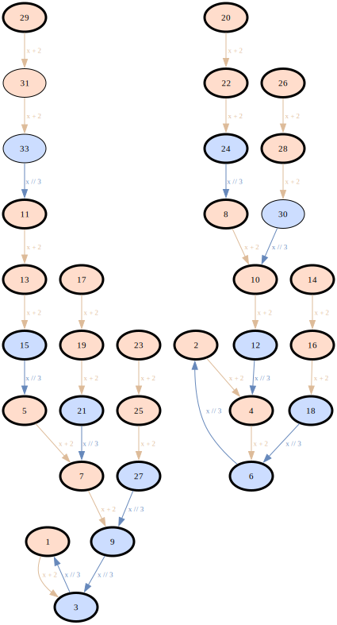

**Reverse binary tree from 1, ceiling at 64, depth-capped at 5:**

```python
ceiling = 64
graph = (viter([1], max_depth=5)
         .case(lambda x: True, lambda x: 2 * x, label="×2",
               bound=lambda x: 2 * x <= ceiling)
         .case(lambda x: True, lambda x: 2 * x + 1, label="×2+1",
               bound=lambda x: 2 * x + 1 <= ceiling)
         .build())
```

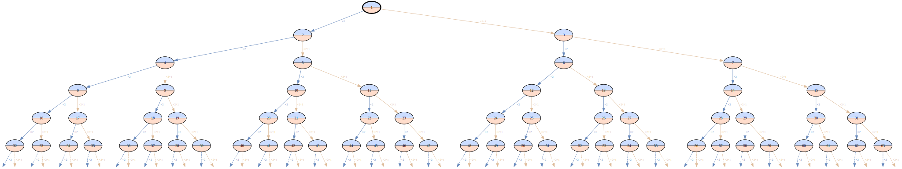

**Multi-way decision via conjunctive cases:**

```python
graph = (viter(range(1, 30),
               tags={"highlight": lambda x: x > 0 and (x & (x - 1)) == 0})
         .case(lambda x: x % 15 == 0, lambda x: x // 15, label="÷15")
         .case(lambda x: x % 3 == 0 and x % 15 != 0, lambda x: x // 3, label="÷3")
         .case(lambda x: x % 5 == 0 and x % 15 != 0, lambda x: x // 5, label="÷5")
         .default(lambda x: x + 1, label="+1")
         .build())
```

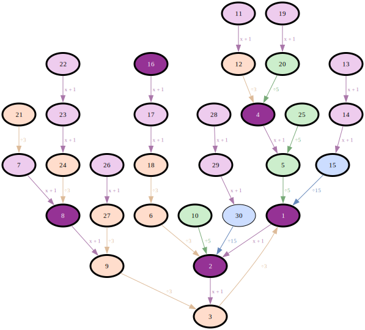

---

## 3. `to_dot` — turning a graph into Graphviz

### Signature

```python
to_dot(graph, *,
             anchor=None, radius=None, direction="both",
             max_depth=None,
             value_range=None,
             op_colors=None, palette=None,
             show_binary=False, show_factors=False,
             node_label=None, node_label_attr=None,
             time_limit=None, on_limit="stop")
```

Also available as `Graph.to_dot(**kwargs)`. Returns a `Dot` wrapper
around a `graphviz.Digraph` with `.source`, `.render(format, file)`,
`.tap(func)`, and `.write(file)`.

### Inputs

- `graph`: dict with the shape produced by `.build()`. Edge labels are
  read directly from each `edge["label"]`/`pseudo_edge["label"]` —
  `to_dot` does not consult `graph["op_labels"]` for edge beschriftung.
  Custom rendering of labels happens at build time (per-call via
  `OpResult`, or per-case via the static `label=` argument on
  `.case()` / `.default()`).
- `anchor`, `radius`, `direction`: BFS neighborhood crop. Only nodes
  within `radius` hops of `anchor` are rendered. `anchor` may be a
  single node value or a list/tuple/set of node values — with several
  anchors the kept set is the union of their `radius`-hop neighborhoods,
  all sharing the same `radius`. `direction` ∈
  `{"forward", "backward", "both"}`. Default `"both"` — an undirected
  neighborhood that shows the full local context around the anchor(s).
  Use `"forward"` to walk edges in their iteration direction ("what
  does the orbit from `anchor` look like?") and `"backward"` to answer
  "what reaches `anchor`?" (natural when the anchor is a sink or fixed
  point).
- `max_depth`: optional int. Render-time depth crop measured from the
  graph's root nodes outward along edges (forward). Only nodes within
  `max_depth` hops of a root survive; deeper nodes are dropped and the
  edges crossing the cut become dashed ghost stubs, just like the
  anchor/radius crop. This is a **display-only** crop, distinct from the
  build-time `max_depth` on `viter(...)` (which caps BFS expansion during
  construction). Combines with anchor/radius and value_range by
  intersection.
- `value_range`: `(low, high)` int tuple. Combines with anchor/radius
  by intersection.
- `op_colors`: optional `{op_id: color}` map. Each value may be a
  single hex string (used for both fill and edge) or a `(fill, edge)`
  tuple for explicit pinning.
- `palette`: optional sequence of palette entries (string or tuple,
  as above). Replaces `DEFAULT_OP_PALETTE` for unmapped ops.
- `show_binary` / `show_factors`: extra annotations under each node
  label. Binary uses 4-bit nibble grouping. Integer-specific — emit
  a warning and skip for non-integer graphs.
- `node_label`: optional `(key, info) → str` callback for custom node
  display. Supports Graphviz HTML-labels (strings starting with `<`
  and ending with `>`).
- `node_label_attr`: name of a per-node attribute whose value is
  rendered as the node label instead of the node key. List/tuple/set
  values format as `{a, b, c}` (no `repr` quotes); scalars use plain
  `str()`.
- `time_limit`, `on_limit`: bound the pure-Python build phase
  (BFS cropping + DOT loops + ghost emission). Independent of any
  subprocess-level Graphviz layout timeout. Defaults align with
  `viter()`'s: `on_limit="stop"` (accepts `OnLimit.STOP` too).

### Coloring model

Color assignment is in two layers:

1. **Op → color pair.** `resolve_op_colors` walks `op_order` (or
   first-seen edges as fallback). Each distinct op gets a `(fill,
   edge)` pair: from `op_colors` if pinned, otherwise from `palette`
   in order. Exhaustion of the palette yields a neutral grey pair.

   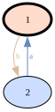

2. **Per-node fill** is computed from the node's distinct outgoing op
   labels (real edges plus pseudo-edges and outgoing-cut edges):
   - 0 ops → no fill (Graphviz default white = leaf)
   - 1 op  → solid `fillcolor`
   - 2+ ops → `style="wedged"` with colon-joined fill colors,
     producing pie-wedge segments inside the ellipse

   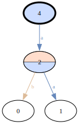

3. **Highlight** (the `"highlight"` tag): the fill colors are
   darkened in HSL space (lightness reduced, hue and saturation
   preserved) so a light blue stays a saturated dark blue rather than
   going grey. Font becomes white for contrast.

   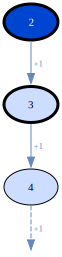

4. **Roots** (any node whose value is in `graph["roots"]`) are
   distinguished by `penwidth="3"` — bold border.

   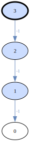

### Ghost stubs (cut boundary)

Three different things produce dashed ghost stubs, all rendered the
same way:

- **Outgoing cut**: `kept_src → outside_dst` was filtered out by
  `anchor/radius` or `value_range`. Rendered as `kept_src → <ghost>`.
  The op contributes to the kept node's fill via `extra_out_ops`.
- **Incoming cut**: `outside_src → kept_dst`. Rendered as
  `<ghost> → kept_dst`. Does not affect fill (fill comes from
  outgoing edges only).
- **Pseudo-edge**: when a case's `bound=` returned False or
  `max_depth` was reached. Rendered the same as outgoing cut
  (kept_src → ghost), shares the fill-contribution path.

The visual vocabulary is uniform: a dashed stub means "the graph
continues here, but we stopped". The semantic source can be read
from context — the `.vit` file, your notes, the legend.

A graph with both kinds of stub — the pseudo-edge at 8 (from
`bound=lambda x: 2*x <= 8`) and an incoming boundary stub at 2 from
the cropped-out parent:

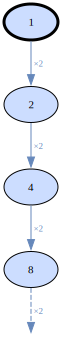

### `value_range` and trees

For tree-shaped graphs (e.g., the reverse binary tree from a single
root), `max_depth=N` is the natural way to show the top N levels — it
crops from the root(s) outward without having to name the root as an
anchor. Equivalently, `anchor=root, radius=N, direction="forward"`
gives the same result when you want to pin a specific root.

For forward-iteration graphs with a sink (cycle),
`anchor=cycle_node, radius=N, direction="backward"` shows the N
levels of predecessors above the cycle.

**`direction` × cycles × determinism.** A subtlety worth naming: with
`direction="forward"` and an anchor **inside a cycle**, the forward
BFS terminates in the cycle. For a *deterministic* iteration (each
node has exactly one outgoing edge — the usual case when your cases
are mutually exclusive plus a default, or when you set
`match=Match.FIRST`), every cycle is closed, so the radius is
effectively ignored once the cycle is entered. In the descent example
below, forward from `1` yields just the two-node 1↔3 cycle regardless
of `radius`. `backward` from the same anchor reaches the full
pre-image tree, bounded by `radius`. When cases fan out (several
match a single node), cycles may have branches leaving them and the
radius starts mattering again.

Same descent graph (`range(1, 30)` under `%3 ÷3` else `+2`), same
anchor `1`, same `radius=8`. `direction="forward"` terminates in the
1↔3 cycle — the ghost stub flags that other nodes still feed into 3
from outside the crop:

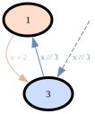

Flipping to `direction="backward"` follows edges against the
iteration, so every value that eventually reaches 1 within 8 hops
shows up:

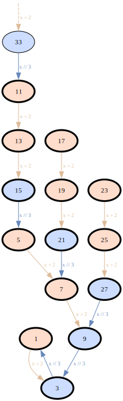

### Examples

**Reverse binary tree, prime-factor annotations on each node:**

```python
graph.to_dot(show_factors=True).render("bt", format="svg")
```

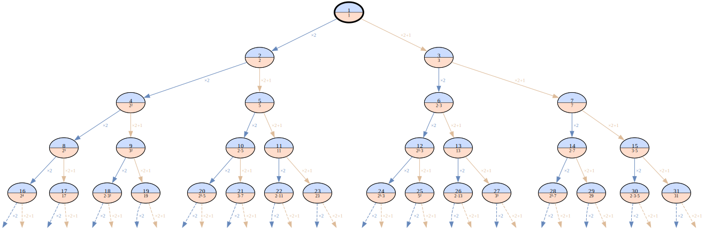

**Descent graph, render only what reaches 1 within 8 hops:**

```python
graph.to_dot(anchor=1, radius=8, direction="backward").render()
```


**Pin specific ops to specific colors.**

`op_colors` is a `{op_id: color}` map. The **value** can be either:

- A **`(fill, edge)` tuple** — two colors, independently. That
  matches the two-layer palette: a light pastel for fills (readable
  labels on top), a saturated mid-tone for edges (thin lines that
  still pop against a white page).
- A **single hex string** — shorthand for `(hex, hex)`, same color
  for both surfaces. Simpler, but the single tone has to work for
  both: pick a color light enough to keep black label text legible
  on the fill and the thin edge line drawn in the same color is
  usually too faint against white; pick dark enough for a visible
  edge and the text contrast on the fill suffers.

**Recommended: freeze the id explicitly when you want to pin.** Pass
`id=` on the `.case(...)` / `.default(...)` call and pin on that
string — it's stable across refactors, identical from Python, the
CLI, and against JSON graphs:

```python
graph = (viter(range(1, 30))
         .case(lambda x: x % 3 == 0, lambda x: x // 3,
               label="÷3", id="div3")
         .default(lambda x: x + 2, label="+2", id="inc2")
         .build())

graph.to_dot(op_colors={
    "div3": ("#ccddff", "#6688bb"),  # (fill, edge) pair — edges stay visible
    "inc2": "#ffdddd",               # single color — edges fade against white
}).render()
```

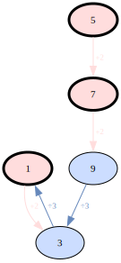

The edge labels in the SVG stay `÷3` and `+2` — `op_colors` pins on
id; display is separate, served from `graph["op_labels"]`.

> **Why pinning on the auto-derived id is fragile.** If you don't
> pass `id=`, the id is whatever `_derive_label(fn)` produced —
> `ast.unparse(lambda_body)` for lambdas, `fn.__name__` for named
> functions. That's an *implementation detail of the source*:
> rewriting `lambda x: x // 3` as `lambda x: x//3` changes the
> unparsed form; renaming the parameter (`lambda y: y // 3` → id
> `"y // 3"`) does too; extracting the lambda into a named function
> shifts it again. Each of those makes your pin silently stop
> matching — the pin is ignored, no error, the op just falls back to
> the next palette slot. Explicit `id=` avoids the whole class.

### Visual vocabulary at a glance

Quick reference for what each rendered element means. Skim this once,
keep it in mind when reading SVGs:

| element                            | meaning                                                                                          |
| ---------------------------------- | ------------------------------------------------------------------------------------------------ |
| **Bold border** (`penwidth=3`)     | node is in `graph["roots"]` — a seed value passed to `viter(...)`                                |
| **No fill (white)**                | leaf: zero outgoing edges — iteration terminates here                                            |
| **Solid fill**                     | exactly one outgoing op; fill = that op's color                                                  |
| **Wedged-pie fill**                | ≥2 distinct outgoing ops; one slice per op                                                       |
| **Darkened fill + white font**     | node carries the `"highlight"` tag (set by a predicate in `viter(..., tags={...})`)              |
| **Dashed edge to a tiny target**   | "ghost stub" — the iteration would continue here but was stopped by a case's `bound=`, `max_depth`, or a render-time crop |

One graph exhibiting every style in the table above:

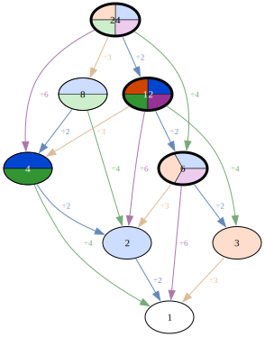

---

## 4. CLI

A `.vit` file is a Python script executed by the `viter` command. The
exec namespace pre-binds `viter`, `Match`, `OnLimit`, `to_dot`,
`Graph`, `NxFilter`, `write`, `Fraction`, and `Decimal`.

### Running a `.vit` file

```bash
viter script.vit                  # SVG to stdout
viter script.vit > out.svg        # redirect to file
viter script.vit --arg value      # pass args to the script
viter --version                   # show version
```

All arguments after the `.vit` path are passed through as `sys.argv`
to the script. The script can use `argparse` or raw `sys.argv`.

### One-shot: `.render()`

For the simplest case — build, render with defaults — the Builder's
`.render()` terminal wraps `build().to_dot().render()`:

```python
#!/usr/bin/env viter
(viter(range(1, 30))
 .case(lambda x: x % 3 == 0, lambda x: x // 3)
 .default(lambda x: x + 2)
 .render())
```

### Fluent chain

When you need `to_dot` options, filters, or intermediate saves, use
the explicit chain — `.build()` returns a `Graph`, and every step
afterwards is chainable:

```python
#!/usr/bin/env viter
(viter(range(1, 30))
 .case(lambda x: x % 3 == 0, lambda x: x // 3)
 .default(lambda x: x + 2)
 .build()
 .tap(write(file="graph.json"))
 .to_dot(anchor=1, radius=8)
 .render(file="out.svg"))
```

### Safety defaults

`viter()` ships conservative defaults so a typo'd rule can't silently
burn minutes or gigabytes:

| Parameter       | Default            | Purpose                                    |
| --------------- | ------------------ | ------------------------------------------ |
| `max_nodes`     | `1024`             | BFS node cap                               |
| `max_depth`     | `64`               | BFS depth cap                              |
| `on_limit`      | `OnLimit.STOP`     | Stop and warn (vs. `OnLimit.RAISE`)        |
| `time_limit`    | `None`             | Wall-clock limit (`"hh:mm:ss"`)            |

When a limit is hit, `.build()` emits a warning to stderr and returns
the partial graph. Pass `None` to disable a limit, or a higher value
to raise it.

### Errors

Any error surfaces as a normal Python exception with its native
traceback. `exec` is appropriate here because this is a local research
tool: running `viter script.vit` is no different in trust model from
running any local Python script.

---

## 5. Recipes

### "I want depth-gradient coloring"

VisIter exposes `depth` per node but doesn't ship a depth-gradient
renderer. Easy to build on top by constructing the graphviz.Digraph
yourself and picking each node's fill via `darken` on a base color:

```python
from visiter import viter, darken
import graphviz

graph = (viter([1], max_depth=6)
         .case(lambda x: x % 3 == 0, lambda x: x // 3, label="÷3")
         .default(lambda x: x + 2, label="+2")
         .build())
max_d = max(info["depth"] for info in graph["nodes"].values()) or 1
base = "#ffccaa"
roots = {str(v) for v in graph["roots"]}

dot = graphviz.Digraph()
dot.attr(rankdir="TB")
dot.attr("node", fontsize="11", shape="ellipse", style="filled")
for k, info in graph["nodes"].items():
    factor = 1.0 - (info["depth"] / max_d) * 0.55
    dot.node(f"n{k}", label=k,
             fillcolor=darken(base, factor),
             penwidth="3" if k in roots else "1")
for e in graph["edges"]:
    dot.edge(f"n{e['from']}", f"n{e['to']}", label=f" {e['op']} ")
```

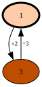

### "I want to limit by absolute value"

Use `value_range=(low, high)` in `.to_dot(...)`. To stop the build
phase from producing huge values in the first place, use a case's
`bound=`.

### "Several disconnected starts, render each cluster separately"

Run `viter(...).build()` once per start, render separately. There's
no built-in multi-rooted layout; Graphviz handles disconnected
components in one canvas if rendered together.

### "I need a custom predicate for highlighting"

Pass it as a `tags` entry on `viter(...)`. The `"highlight"` tag
name is the renderer's visual emphasis trigger:

```python
graph = (viter(..., tags={"highlight": lambda x: is_prime(x)})
         .case(...)
         .default(...)
         .build())
```

Other tag names are stored on nodes too and accessible via
`graph["nodes"][vstr]["tags"]`, but only `"highlight"` triggers the
renderer's fill-darkening logic.

### "I want if-elif-else semantics"

Set `match=Match.FIRST` on `viter(...)` — only the first matching case
fires, and the default covers "nothing matched":

```python
(viter(range(1, 17), match=Match.FIRST)
 .case(lambda x: x % 2 == 0, lambda x: x // 2)
 .case(lambda x: x % 3 == 0, lambda x: x // 3)
 .default(lambda x: x * 5 + 7)
 .build())
```

For a mixed chain (some cases additive, some exclusive), leave
`match=Match.ALL` (the default) and flip individual cases with
`exclusive=True`.

### "I want to use `Fraction` / `Decimal` / other domain numeric types"

The default per-node classification comes from `json_type`, which
only knows about Python's built-in JSON types. Anything outside that
set — `fractions.Fraction`, `decimal.Decimal`, `sympy.Rational`, a
custom quantity class — falls through to `"string"` because those
values serialise through `str()`. Pass `key_type=` on `viter(...)`
to declare the true semantic type.

As a worked example, the continued-fraction recurrence `x ↦ 1 + 1/x`
starting at `1` produces the Fibonacci-ratio convergents to the
golden ratio. With `Fraction` the arithmetic is exact; without the
`key_type=` override every node would be labelled `"string"` in the
graph dict — honest for JSON-on-the-wire, misleading for what the
values actually mean.

`Fraction` and `Decimal` are pre-bound in the `.vit` namespace:

```python
#!/usr/bin/env viter
(viter([Fraction(1)], max_depth=7, key_type="number")
 .case(lambda x: True, lambda x: 1 + 1 / x)
 .render())
```

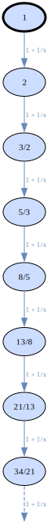

Two forms of `key_type=` are available:

- **A plain string** — one of the JSON Schema primitives (`"null"`,
  `"boolean"`, `"integer"`, `"number"`, `"string"`, `"array"`,
  `"object"`) — sets one fixed classification on every node.
- **A callable `value → str | None`** — called per value; return one
  of those primitives, or `None` to delegate to `json_type` for that
  value. Useful when a single graph mixes domain types (e.g. ints
  and `Fraction`s coexisting) and you want `json_type`'s defaults on
  the integers but an override on the rationals:

  ```python
  from fractions import Fraction
  (viter([1, Fraction(1, 2)],
         key_type=lambda v: "number" if isinstance(v, Fraction) else None)
   .build())
  ```

The override is a **declaration of intent**, not a transformation:
renderer features that actually consume the value still have to be
able to handle what you passed. `value_range` in particular calls
`int(vstr)` on the node keys, which fails on `"1/2"`; so declaring
`Fraction` values as `"number"` does *not* unlock `value_range` for
them. Pick the classification that matches how downstream consumers
should treat the data, and keep the data compatible with the claim.

**Beyond `Fraction` and `Decimal`.** Any other type —
`sympy.Rational`, a third-party quantity class, your own domain
object — just needs a standard `import` in the `.vit` file:

```python
#!/usr/bin/env viter
from sympy import Rational

(viter([Rational(1, 2)], key_type="number")
 .case(lambda x: x.q < 100, lambda x: 1 + 1 / x)
 .build())
```

A runnable end-to-end version of this pipeline lives in
[`demos/basics/golden_ratio.vit`](../demos/basics/golden_ratio.vit).

---

## 6. Reference: complete graph dict shape

```python
{
    "schema_version": "1",           # bundled schema major version

    "roots": [value, ...],

    "nodes": {
        str(value): {
            "depth":    int,            # required: BFS distance from nearest start
            "key_type": str,            # required: JSON type of the value
                                        #   (one of "null", "boolean", "integer",
                                        #   "number", "string", "array", "object")
                                        #   — drives type-sensitive rendering
            "tags":     [str, ...],     # optional: present iff at least one tag matched
        },
        ...
    },

    "edges": [
        {"from": A, "to": B, "op": str},   # op = identity (see op_labels)
        ...
    ],

    "pseudo_edges": [
        {"from": A, "op": str},            # op = identity
        ...
    ],

    "op_order": [str, ...],          # distinct op identities in case-declaration order, then default

    "op_labels": {                   # map from identity → display label
        identity_str: display_str,
        ...
    },
}
```

`to_dot` requires `roots`, `nodes`, `edges`. The other fields are all
optional in the renderer's eyes — consumed if present, ignored
otherwise.

### Value types

Values in an iteration graph can be any hashable Python object:
integers, strings, tuples of hashables, frozensets, etc. `.build()`
keys nodes by `str(value)`, so two values with the same string form
collide. On JSON output, native JSON types pass through unchanged;
non-native values are coerced to their `str()` form by the CLI's
`json.dump(default=str)`. The schema reflects this by accepting any
JSON type for edge `from`/`to` and any non-empty string for node
keys.

To let consumers recover the type of a node value despite JSON's
string-keys constraint, `.build()` records it explicitly as a
required `key_type` attribute on each node — using the seven
JSON Schema primitives (`null`, `boolean`, `integer`, `number`,
`string`, `array`, `object`) so any JSON consumer can interpret it
without Python-specific knowledge. The Python → JSON mapping is:
`bool` → `boolean`, `int` → `integer`, `float` → `number`, `str` →
`string`, `list`/`tuple`/`set`/`frozenset` → `array`, `dict` →
`object`, `None` → `null`; anything else falls back to `string` via
the default `str()` coercion. The renderer consults `key_type`
directly when deciding whether type-sensitive features
(`show_binary`, `show_factors`, `value_range`)
should fire — no string-pattern heuristic is involved. Hand-built
graph dicts and producers other than `.build()` must supply
`key_type` themselves; the schema enforces this via `required`.

For domain types whose values do not fit the built-in mapping —
`fractions.Fraction`, `decimal.Decimal`, `sympy.Rational`, a custom
quantity class — pass `key_type=` to `viter(...)` to override the
default. A bare string sets a single type for every node; a callable
`value → str | None` classifies per value, with `None` delegating to
`json_type` for that particular value. Type-sensitive renderer
features still require that the downstream value is actually
representable as the claimed type (e.g. `value_range` casts node
keys via `int(...)`, which fails on `"1/2"`), so the override is a
declaration of intent, not a transformation — keep the data
compatible with the claim.

### JSON Schema

The authoritative machine-readable contract lives at
[`schemas/v1/graph.schema.json`](../schemas/v1/graph.schema.json)
(JSON Schema Draft 2020-12). It is bundled with the package and
served under the `$id` URL
`https://github.com/yaccob/visiter/schemas/v1/graph.schema.json`.

Versioning policy: v1 accepts non-breaking additions (new optional
fields, new enum values) in place. Breaking changes ship under `/v2/`
with a new `$id`; v1 stays frozen. The `schema_version` field on the
graph instance identifies the major version.

Validate a graph document programmatically:

```bash
pip install visiter[validate]
```

```python
import json
from importlib.resources import files
from jsonschema import Draft202012Validator

schema = json.loads(files("visiter").joinpath(
    "schemas/v1/graph.schema.json").read_text())
Draft202012Validator(schema).validate(graph_dict)
```

---

## 7. Integrating with NetworkX

VisIter builds iteration graphs and renders them. For everything in
between — cycle detection, shortest paths, centrality measures,
strongly-connected components, topological sort, bipartite matching,
community detection, and many more — [NetworkX](https://networkx.org/)
is the mature Python answer. Rather than wrap any of NetworkX's
algorithms ourselves, VisIter ships a thin *bridge* that translates
between its own graph dict and a `networkx.DiGraph`.

### Install

```bash
pip install visiter[analytics]
```

That pulls `networkx>=3.0` alongside VisIter's core deps.

### Python API

`visiter.analytics` exports two functions:

```python
from visiter import viter, to_dot
from visiter.analytics import to_networkx, from_networkx
import networkx as nx

graph = (viter(range(1, 30))
         .case(lambda x: x % 3 == 0, lambda x: x // 3, label="÷3")
         .default(lambda x: x + 2, label="+2")
         .build())

g = to_networkx(graph)
# Now the entire NetworkX toolbox is available:
cycles       = list(nx.simple_cycles(g))
path_to_one  = nx.shortest_path(g, source="5", target="1")
centrality   = nx.in_degree_centrality(g)
condensation = nx.condensation(g)   # a new nx.DiGraph, one node per SCC

# If the NetworkX call returns a graph, you can render that too:
dot = to_dot(from_networkx(condensation))
```

`to_networkx` preserves node keys (as strings — this is the only
identity the graph dict actually guarantees) and every node
attribute, including `depth`, `tags`, and `key_type`. Edge attributes
(`op`) pass through as well. Top-level fields (`roots`,
`pseudo_edges`, `op_order`, `schema_version`) are stashed on
`nx.DiGraph.graph` so `from_networkx` can reproduce the original
dict exactly. Round-trip is information-preserving for VisIter
graphs.

For bare NetworkX graphs without VisIter metadata you still get a
minimal, schema-valid result: missing `depth` defaults to 0, and
`key_type` is inferred from the JSON type of the NX node id — that's
the only honest signal available when the producer didn't set it
explicitly.

**Attribute pass-through** is what lets NX algorithms that annotate
nodes stay useful on our side. `nx.condensation`, for instance, tags
each SCC-node with a `members` attribute (a frozenset of the original
nodes in that component). `from_networkx` carries the attribute
through to the graph dict; non-JSON values like frozensets are
coerced to sorted lists so the result stays serialisable.

Once the attribute is in the graph dict, you can tell the renderer
to use it as the displayed label instead of the node key via
`to_dot`'s `node_label_attr` kwarg (or the matching argument on the
CLI). List/tuple/set values get formatted as `{a, b, c}`
automatically (no `repr` quotes); scalars render as plain `str()`:

```python
graph.to_dot(node_label_attr="members").render()
```

```python
# In a .vit file — NxFilter handles the round-trip:
(viter(...).case(...).default(...).build()
 .filter(NxFilter(nx.condensation))
 .to_dot(node_label_attr="members")
 .render())
```

See [`demos/integration/condensation.vit`](../demos/integration/condensation.vit)
for the full end-to-end example.

### Fluent chain: `NxFilter`

For graph-to-graph transforms, `NxFilter` plugs into the fluent chain:

```python
#!/usr/bin/env viter
import networkx as nx

(viter(...).case(...).default(...).build()
 .filter(NxFilter(nx.condensation))
 .to_dot()
 .render())
```

For ad-hoc inspection (scalar results, cycle lists, centrality), use
NetworkX directly in the `.vit` file:

```python
from visiter.analytics import to_networkx
nxg = to_networkx(graph)
print(list(nx.simple_cycles(nxg)))
print(nx.in_degree_centrality(nxg))
```

See the [`demos/integration/`](../demos/integration/) directory for
runnable end-to-end examples.

### Worked example: water jug shortest path

The classic "Die Hard 3" puzzle: measure exactly 4 litres with a 3L
and a 5L jug. Six actions (fill, empty, pour) build a 16-node
reachability graph from `(0, 0)`. The graph has non-trivial cycles
because the actions are not self-inverse (fill ≠ empty).

The full graph, with target states (where either jug holds 4)
highlighted:

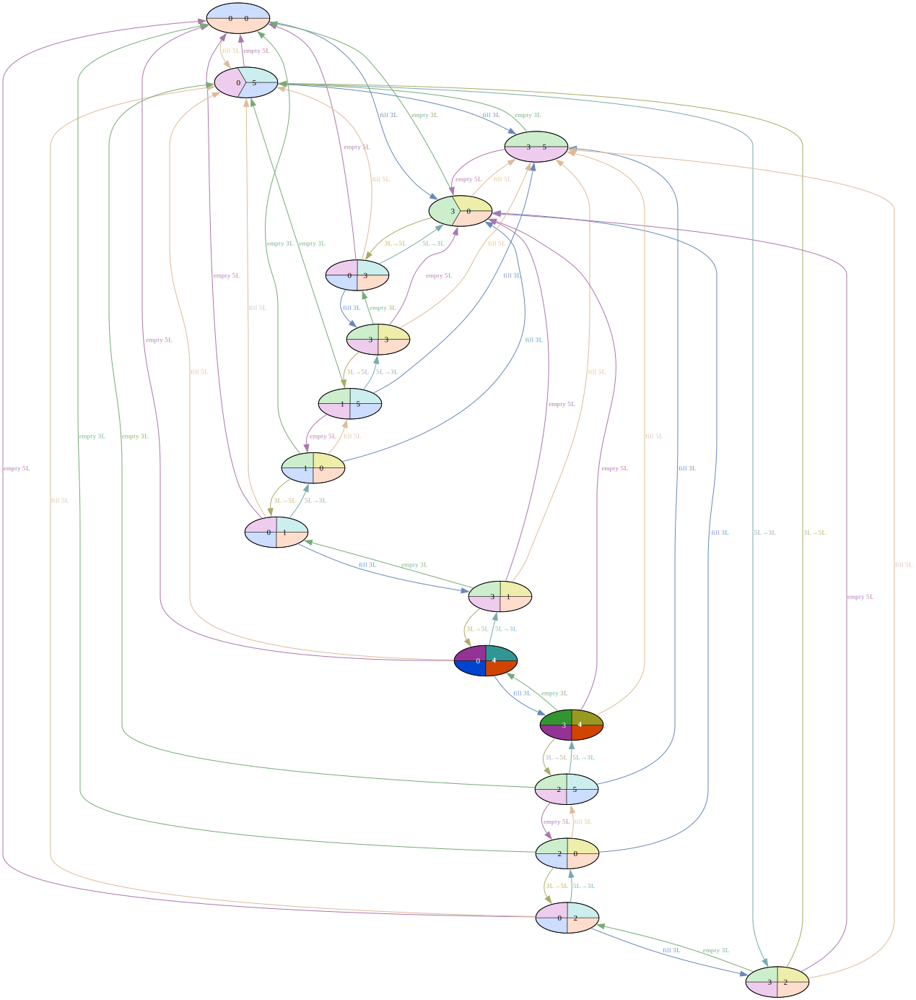

The solution is the shortest path from `(0, 0)` to any target node.
`nx.all_shortest_paths` finds it; extracting the path nodes and edges
into a subgraph and rendering that through `to_dot` produces the
answer as a standalone image:

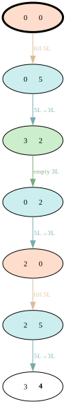

Bold cell values mark the target amount; the darkened node is the
goal state where the path ends. The full pipeline (build → analyze →
subgraph → render) is in
[`demos/applications/water_jugs.vit`](../demos/applications/water_jugs.vit).

### Scope

The bridge is deliberately thin: two Python functions plus one
`.filter()` hook. We don't wrap individual NetworkX algorithms —
their names are already their documentation, and wrapping would only
duplicate surface area we can't maintain. Everything NetworkX can do
is one `nx.<something>(graph)` call away.

---

## 8. Optional native acceleration and columnar storage

These features are **optional and additive**. Pure Python with JSON is the
always-available baseline; nothing below changes default behavior or output —
the native paths produce graphs byte-identical to the pure-Python build.

### Two performance paths

VisIter spends its build time in two places: bookkeeping (BFS expansion,
deduplication, node identity) and the user's callbacks. There are two
independent native paths, for two different workloads:

- **Path A — native engine, Python callbacks (`engine=`).** Moves only the
  *bookkeeping* to native code; the callbacks stay Python. Best when callbacks
  are cheap and the graph is large.
- **Path B — inline Rust callbacks (`lang="rust"`).** Compiles the *callbacks*
  themselves to native code. Best when callbacks are expensive (the case where
  Path A barely helps, because the Python callback dominates).

### Path A — `engine=` (the `visiter_native` extension)

Install the optional extension — a prebuilt wheel (`abi3`, CPython 3.11+), no
toolchain needed:

```bash
pip install "visiter[native]"   # prebuilt wheel
make native                     # or build it locally (needs a Rust toolchain)
```

Once installed, `engine="auto"` (the default) routes **every** build through the
native engine and only falls back to pure Python when the extension is absent.
The native engine handles the full semantics — `max_depth`/`max_nodes`/`bound`
truncation and pseudo-edges included — calling your Python callables per node
(via PyO3) while replacing the `str(value)` keying and dict bookkeeping with
native hashing and a compact layout.

```python
# Native when the extension is present (bounded or not); else pure Python.
viter([(0, 0)], max_depth=None, max_nodes=None, engine="auto")  # default
viter([(0, 0)], max_depth=8, engine="auto")   # bounded — also native
viter(10, engine="native")                     # require native; raise if absent
viter(10, engine="python")                     # always pure Python
```

`engine="native"` raises `RuntimeError` only when the extension is missing;
`engine="auto"` silently falls back to pure Python in that case. The native path
keeps `tags`, `key_type`, `OpResult`, `Match.FIRST`, `default`, and the bounded
limits working and yields the same graph dict (byte-identical for the
deterministic limits; `time_limit` is best-effort).

### Path B — `lang="rust"` (inline Rust-expression callbacks)

With `lang="rust"`, `.case()` / `.default()` take **Rust expression strings**
instead of Python lambdas. The current value is bound to `s`; the expression is
the edge label/id when no `label=`/`id=` is given. The expressions are
co-located at the call site, compiled once with `rustc` (cached on a hash of the
generated source), and run natively.

```python
#!/usr/bin/env viter
# Nim, with native callbacks. `s` is the current value.
(viter(10, lang="rust")
 .case("s >= 1", "s - 1", label="take 1")
 .case("s >= 2", "s - 2", label="take 2")
 .case("s >= 3", "s - 3", label="take 3")
 .render())
```

Constants are injected with `consts=` (i64), and tuple state uses `s.0`, `s.1`:

```python
(viter([(0, 0)], lang="rust", consts={"A": 3, "B": 5})
 .case("s.0 < A", "(A, s.1)", label="fill A")
 .case("s.1 < B", "(s.0, B)", label="fill B")
 .case("s.0 > 0 && s.1 < B",
       "(std::cmp::max(0, s.0 - (B - s.1)), std::cmp::min(B, s.0 + s.1))",
       label="A->B")
 .render())
```

`lang="rust"` is a **drop-in**: the same chain yields the same graph as the
Python path, byte-for-byte. Requirements and scope:

- **`rustc` must be on `PATH`** (install via <https://rustup.rs>); `Fraction`
  values additionally need `cargo` (they pull `num-rational`/`num-bigint`).
  There is no Python fallback for Rust source — use `lang="python"` in
  toolchain-less environments. The first build per unique source pays a compile
  cost; later builds hit the cache.
- **State values:** `int`, `tuple`-of-`int` (arity ≥ 2), `str`, or `Fraction`
  (exact rationals), inferred from the start values. Node keys match Python's
  `str()` exactly. Rationals bind `s` as `&BigRational` with an `r(n)` helper,
  so e.g. golden ratio is `.case("true", "r(1) + s.recip()")`.
- **Full behavioral parity:** `max_depth`, `max_nodes` and `time_limit` apply
  with the same defaults as the Python path (64 / 1024) and produce the same
  ghost-stub pseudo-edges / truncation; `bound=` predicates, `tags=`
  (Rust-string predicates), `key_type=`, `Match.ALL`/`Match.FIRST`, `default`,
  `on_limit`, and per-call edge labels (`label_rs=`, the `OpResult` analogue)
  all behave identically.
- **The one gap:** heterogeneous value types — a chain whose values are not all
  the same type — which rustc rejects as a clear compile error rather than a
  silent divergence. `Decimal` stays Python-only.
- Runnable examples: [`demos/rust/`](../demos/rust/).

### Columnar storage — `.vitgraph` (the `[storage]` extra)

JSON (`Graph.write()`) stays the default, human-readable format. For large
graphs, a columnar format is far smaller and faster:

```bash
pip install "visiter[storage]"     # pulls pyarrow
```

```python
graph.to_vitgraph("g.vitgraph")          # write (Arrow IPC + zstd in a zip)
graph = Graph.from_vitgraph("g.vitgraph")  # read back
nodes, edges, pseudo = graph.to_arrow()  # pyarrow Tables for analytics
```

A `.vitgraph` stores the graph as two columnar tables (nodes, edges) plus
metadata in a single zip container: edge endpoints are interned to int32 node
ids (instead of repeated string keys), and the categorical columns (`op`,
`label`, `key_type`) are dictionary-encoded. The result is **~10–25× smaller
than JSON** for graphs of a few hundred nodes and up (with much faster load and
columnar analytics); below ~50 nodes the columnar overhead makes JSON smaller,
which is fine — small graphs use JSON anyway. Round-trip fidelity matches JSON:
node keys are `str(value)`, so JSON-native `roots` (ints, strings) round-trip
exactly while tuple `roots` come back as lists.
