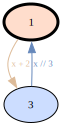
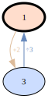
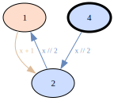
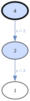
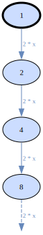
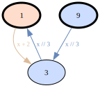
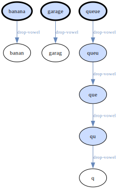

# VisIter — a gentle introduction

> **TL;DR** — build a graph, render it:
>
> ```python
> #!/usr/bin/env viter
> (viter([1])
>  .case(lambda x: x % 3 == 0, lambda x: x // 3)
>  .default(lambda x: x + 2)
>  .render())
> ```
>
> Save as `first.vit`, run with `viter first.vit > out.svg`.
>
> Read on for the concepts behind this.

---

This tutorial walks you from "what is this for?" to "I can build my
own visualizations" in a handful of small steps. Each section is one
question. Skim the questions first; jump in where it feels useful.

When you want details, the [manual](manual.md) is the reference. When
you want to **see** something running, the [demos](../demos/) ship as
runnable `.vit` files (`make demo` runs them all).

---

## What problem does VisIter solve?

You have an iteration: a value, a rule that produces the next value
(or several), and you want to **see** what happens. Where does it
converge? Does it cycle? Does it branch out and come back? Does it
escape to infinity?

Plotting numbers in a chart doesn't help — iteration structure isn't
about magnitudes, it's about **which value goes to which**. What you
actually want is a graph: nodes are reachable values, edges are
applied operations. Then you can read off cycles, branches, and
attractors at a glance.

VisIter does exactly that, through a fluent pipeline:

1. **`viter(iterable)`** starts a builder you configure with
   `.case(...)` and optionally `.default(...)`.
2. **`.build()`** runs the rules from your starting values and returns
   a `Graph` (a dict subclass) — or use **`.render()`** as a
   one-shot shortcut that builds, converts to DOT, and renders.
3. The `Graph` itself supports further chaining: `.to_dot(...)` for
   cropping/coloring options, `.filter(...)` for graph transforms
   (e.g. NetworkX bridges), `.tap(...)` for side-effects like JSON
   snapshots.

The stages are independent. You can build a graph and analyze it
programmatically, or render someone else's graph dict.

---

## What does the simplest case look like?

Start from 1. Whenever the value is divisible by 3, divide it by 3.
Otherwise, add 2.

```python
#!/usr/bin/env viter
(viter([1])
 .case(lambda x: x % 3 == 0, lambda x: x // 3)
 .default(lambda x: x + 2)
 .render())
```

Read it back: from 1 the case doesn't apply (1 isn't divisible by 3),
so the default fires and we get 3. From 3 the case fires, dividing
back to 1. There's the cycle — and the rendered graph shows two nodes
and two arrows that prove it.



---

## How are edge labels chosen?

Notice the edges above read `x // 3` and `x + 2` — no labels were
passed. `.case()` and `.default()` derive a label from their callable:
the function's `__name__` for named functions, or the lambda body
rendered via `ast.unparse` for lambdas. That covers most cases with no
typing.

When you want something shorter, nicer, or non-ASCII, pass `label=`
explicitly:

```python
.case(lambda x: x % 3 == 0, lambda x: x // 3, label="÷3")
.default(lambda x: x + 2, label="+2")
```



Explicit labels are also the escape hatch when auto-derivation can't
identify the callable — `functools.partial`, REPL lambdas built from
an unreachable source, or several lambdas on one line that differ
only by whitespace.

Cases also carry a separate **`id=`** field — the stable key used by
color pinning (`op_colors`) and by `op_order`. By default it's the
**auto-derived form of the function** (the same string `_derive_label`
produces), *not* the user-chosen display label. That means two cases
built from the same function share an id even when their display
labels differ, and pins you set via `op_colors` don't break when you
later rename a label. Set `id=` explicitly when you want a stable,
short key for pinning.

### Per-call labels via `OpResult`

The `label=` argument sets the *static* label — the same string on
every edge produced by that case. When you want the label to vary per
call (e.g. annotate a Collatz step with how many bits got dropped, or
tag a graph-search edge with the cost it carried), have the function
return `OpResult(value, label=…)` instead of a plain value:

```python
from visiter import OpResult, viter

def odd_step(x):
    increased = 3 * x + 1
    div = (increased & -increased).bit_length() - 1
    return OpResult(increased >> div, label=f"3x+1, ÷2×{div}")

(viter([27])
 .case(lambda x: x % 2 == 0, lambda x: x // 2, label="÷2")
 .default(odd_step, label="3x+1")
 .build())
```

Returning a plain value is unchanged — you only opt into `OpResult`
where you actually want a per-call label. `OpResult(value)` and
`OpResult(value, label=None)` are equivalent and fall back to the
static label, so a partially-dynamic `fn` can opt out per call without
switching its return shape. The discrimination is by `isinstance`, so
the `value` field can carry a tuple, frozenset, or custom object —
no risk of misreading a 2-tuple value as `(value, label)`.

Pseudo-edges (suppressed by `bound=False` or `max_depth`) never invoke
`fn`, so they always carry the static label.

---

## What happens when no case applies?

That's what `.default()` answers:

- `.default(fn)` — apply `fn` when nothing else fires. Useful when
  "everything not covered by my cases takes this other path" describes
  your iteration honestly.
- Omit `.default()` entirely (or call `.default()` with no argument) —
  declare the value a leaf. The graph just stops there.

With `.default(lambda x: x + 1)`, the value whose case didn't match
still gets a successor:



Without a default, the same value is a leaf — drawn white, because
it has no outgoing edge:



---

## When do multiple cases all fire? When does only the first?

By default, **every case whose condition matches fires** — that's how
you get multi-edge fan-out and the characteristic wedge-pie fills for
nodes with more than one applicable op. If both `x % 2 == 0` and
`x % 3 == 0` apply, both edges are produced.

When you want if-elif-else semantics (only the first matching case
fires), pass `match=Match.FIRST` to `viter(...)`:

```python
(viter(range(1, 17), match=Match.FIRST)
 .case(lambda x: x % 2 == 0, lambda x: x // 2)
 .case(lambda x: x % 3 == 0, lambda x: x // 3)
 .default(lambda x: x * 5 + 7)
 .render())
```

For fine-grained control, each `.case()` can be marked individually
with `exclusive=True` — the match short-circuits after a matched
exclusive case. That lets you mix additive and exclusive cases in the
same chain; later, non-exclusive cases that a previous exclusive case
short-circuited past simply don't run.

---

## How do I stop the iteration from running forever?

Three orthogonal mechanisms, used in combination as needed:

- **`.case(..., bound=pred)`** — *"this op IS applicable, but stop here
  anyway"*. The next example uses it: doubling is always meaningful,
  but `bound` caps the value at a ceiling.
- **`max_depth`** — soft cap on BFS depth. Nodes at the limit are
  kept, just not expanded.
- **`max_nodes`** / **`time_limit`** — hard resource limits. Default
  behavior is to stop and emit a warning; pass `on_limit=OnLimit.RAISE`
  (or the string `"raise"`) to get an exception instead. Defaults:
  `max_nodes=1024`, `max_depth=64`; pass `None` to disable.

`bound` and `max_depth` produce **pseudo-edges** — entries that record
"an op would have fired here". The renderer turns them into dashed
ghost stubs at the boundary, so you can tell the difference between
"the iteration genuinely terminates here" (no ghost) and "the
iteration continues, we just stopped looking" (ghost).

Doubling from 1 with `bound=lambda x: 2*x <= 8` stops the BFS at 8 —
the dashed stub on 8 says "×2 would fire here, we chose not to":



---

## What if the same value is reached two different ways?

VisIter de-duplicates nodes by `str(value)`. The second visit just
adds the edge — the node already exists. This is BFS, so each node's
recorded `depth` is the *minimum* hop count from the nearest start —
you always see the shortest path's depth, never an arbitrary
traversal-order depth.

That's exactly what makes graphs from VisIter useful: cycles, joins,
and shared subpaths show up as actual graph topology, not as
mysteriously duplicated subtrees.

Starting from `[1, 9]` with the same divide-by-3-else-+2 chain, 3 is
reached once from 1 (via +2) and once from 9 (via ÷3) — a single
node with two incoming edges, not a duplicate:



---

## How do I show only a slice of a big graph?

Render-time cropping. `.to_dot()` takes `anchor` (a node value, or a
list of them) plus `radius` (BFS hop count) and an optional
`direction`:

```python
(viter(range(1, 30))
 .case(lambda x: x % 3 == 0, lambda x: x // 3)
 .default(lambda x: x + 2)
 .build()
 .to_dot(anchor=1, radius=2, direction="backward")
 .render())
```

This says: keep nodes within 2 hops of node 1, walking edges
**backward** (so you see what reaches 1, not what 1 reaches). The
edges that leave the kept region are drawn as dashed ghost stubs —
same vocabulary as the bound/max_depth boundary.

`direction="both"` (the default) walks edges undirected and shows the
full local context around the anchor. `"forward"` is the natural choice
for tree-shaped graphs expanded from a root (follow the iteration's own
direction); `"backward"` is natural for graphs with a sink/cycle whose
pre-image you want to inspect. On a deterministic 1-out graph, `"both"`
collapses to `"backward"` (forward adds only the single onward step).

To pass a list, `anchor=[1, 7]` keeps the union of both neighborhoods,
each bounded by the same `radius`.

For the common "top N levels from the root" crop there is a dedicated
`max_depth=N` — it measures depth from the root(s) outward, so you don't
have to name the root as an anchor:

```python
(viter([1], max_depth=10)
 .case(lambda x: True, lambda x: 2 * x)
 .case(lambda x: True, lambda x: 2 * x + 1)
 .build()
 .to_dot(max_depth=3)   # render only the top 3 levels; deeper → ghost stubs
 .render())
```

Note the two `max_depth` are different layers: the one on `viter(...)`
caps how deep the graph is *built*; the one on `.to_dot(...)` only crops
what is *rendered*.

The descent graph (`range(1, 30)` under %3-else-+2) from anchor 1,
radius 8, is a small orbit forward but a whole pre-image tree
backward:

**`direction="forward"`** — only the 1↔3 cycle itself (with a dashed
stub for "other nodes still feed in from outside"):


**`direction="backward"`** — every predecessor within 8 hops:


See [`demos/rendering/cropping.vit`](../demos/rendering/cropping.vit)
and [`demos/rendering/custom_colors.vit`](../demos/rendering/custom_colors.vit)
for examples.

---

## What do the node styles mean?

The renderer uses a small visual vocabulary so the picture itself
carries semantic information:

- **Bold border** (`penwidth="3"`) — this node is a *root*: one of the
  seed values you passed to `viter(...)`.
- **No fill (white)** — leaf: zero outgoing edges. The iteration
  terminates here naturally.
- **Solid fill** — node has exactly one outgoing op label; the fill
  is that op's color.
- **Wedged-pie fill** — node has two or more distinct outgoing op
  labels; the slices are colored after each op (one slice per op).
- **Darkened fill + white font** — the node carries the `"highlight"`
  tag (set by a predicate you passed to `viter(...)`'s `tags` argument).

So at a glance: bold border = where you started; white = where you
stopped naturally; multi-color pie = where the iteration branches;
dark = whatever your highlight predicate matched.

One graph exhibiting every style:


## What do the dashed arrows mean?

Three different things, all rendered identically:

1. The iteration **could continue** but a case's `bound=` said no.
2. The iteration **could continue** but `max_depth` was reached.
3. The renderer **cropped** the view (anchor/radius or value_range)
   and an edge crossed the boundary.

The visual vocabulary is uniform on purpose: a dashed stub means *"the
graph continues here, but we stopped looking"*. The semantic source
is whatever you set up — the legend, the docstring, your own notes.

A graph combining both kinds — a pseudo-edge from a `bound` at 8 on
the 1-branch, and a cropped-out incoming stub at 2:


---

## Does this only work for numbers?

No. Values can be any hashable, `str()`-able Python object: integers,
strings, tuples, frozensets. The condition and op functions just need
to agree on the type. See
[`demos/basics/string_iteration.vit`](../demos/basics/string_iteration.vit) for
a string-valued example (drop trailing vowels until none remain).

A few `to_dot` features are intrinsically integer-specific —
`show_binary`, `show_factors`, and `value_range`. If you turn them on
for a non-integer graph, they emit a warning and are silently skipped;
everything else still renders normally.

Iterating on words, dropping each trailing vowel until the last
character is a consonant — string nodes, integer-free graph:



---

## What does the command line look like?

A `.vit` file is a Python script using the fluent API. The `viter`
command executes it with `viter`, `Match`, `OnLimit`, `to_dot`,
`Graph`, `write`, `NxFilter`, `Fraction`, and `Decimal` pre-bound —
no imports needed for the common case:

```python
#!/usr/bin/env viter
(viter(range(1, 30))
 .case(lambda x: x % 3 == 0, lambda x: x // 3)
 .default(lambda x: x + 2)
 .build()
 .to_dot(anchor=1, radius=8, direction="backward")
 .render())
```

```bash
viter descent.vit > out.svg
```

For the simplest case — build + render with defaults — the
builder's `.render()` method does it in one call:

```python
#!/usr/bin/env viter
(viter(range(1, 10))
 .case(lambda x: x % 3 == 0, lambda x: x // 3)
 .default(lambda x: x + 2)
 .render())
```

`.vit` files can use `argparse` for parametrization — all arguments
after the `.vit` path are passed through as `sys.argv`:

```bash
viter demos/applications/water_jugs.vit --cap-a 4 --cap-b 7 --target 5
```

See the [demos/](../demos/) for runnable examples.

---

## Can I run graph algorithms on the result?

Yes — via the `[analytics]` extra, which bridges VisIter's graph dict
to [NetworkX](https://networkx.org/). NetworkX ships hundreds of graph
algorithms (cycles, shortest paths, centrality, condensation,
strongly-connected components, ...); VisIter doesn't wrap them, it
just hands the graph over.

```bash
pip install visiter[analytics]
```

Use `NxFilter` to plug a NetworkX transform into the fluent chain:

```python
#!/usr/bin/env viter
import networkx as nx

(viter(range(1, 30))
 .case(lambda x: x % 3 == 0, lambda x: x // 3)
 .default(lambda x: x + 2)
 .build()
 .filter(NxFilter(nx.condensation))
 .to_dot()
 .render())
```

For ad-hoc inspection, use NetworkX directly in the `.vit` file:

```python
from visiter.analytics import to_networkx
nxg = to_networkx(graph)
print(list(nx.simple_cycles(nxg)))
```

See the [manual's NetworkX section](manual.md#7-integrating-with-networkx) and
the [`demos/integration/`](../demos/integration/) examples for more.

## What does the JSON Schema buy me?

The graph-dict shape is formally specified as a JSON Schema (Draft
2020-12) at
[`schemas/v1/graph.schema.json`](../schemas/v1/graph.schema.json).

That gives you three things:

- A machine-readable contract for tools that consume builder output.
- A pipeline checkpoint: validate graph dicts programmatically via
  `jsonschema`.
- A versioning anchor: future breaking changes ship under `/v2/`,
  v1 stays frozen, instances self-identify via `schema_version`.

Install the optional extra to use the validator:

```bash
pip install visiter[validate]
```

---

## What if the graph is huge, or the callbacks are slow?

Everything so far is pure Python — it needs no toolchain and is the default.
For large state spaces there are two **optional** native accelerators (both
produce the same graph, byte-for-byte) and a compact storage format.

The two accelerators target two different costs:

- **Slow *bookkeeping*, cheap callbacks** → the native engine. Build the
  optional extension once with `make native` (needs a Rust toolchain), then
  it kicks in automatically for unbounded builds:

  ```python
  viter([(0, 0)], max_depth=None, max_nodes=None)  # engine="auto" by default
  ```

  If the extension isn't installed, you get pure Python — nothing breaks.

- **Slow *callbacks*** (the case where moving only the bookkeeping barely
  helps) → write the callbacks in Rust, inline, with `lang="rust"`. The
  current value is bound to `s`, and the expression compiles on the fly:

  ```python
  (viter(10, lang="rust")
   .case("s >= 1", "s - 1", label="take 1")
   .case("s >= 2", "s - 2", label="take 2")
   .render())
  ```

  This needs `rustc` on `PATH`; there's no Python fallback for Rust source.
  See [`demos/rust/`](../demos/rust/) for runnable examples.

And when a graph is too big to keep as JSON, store it columnar — typically
10–25× smaller, much faster to load (`pip install "visiter[storage]"`):

```python
graph.to_vitgraph("g.vitgraph")
graph = Graph.from_vitgraph("g.vitgraph")
```

The [manual](manual.md#8-optional-native-acceleration-and-columnar-storage)
covers all three in detail.

---

## Where do I go from here?

- The [manual](manual.md) is the reference — every parameter, every
  data field, the rendering model in full, design decisions.
- The [demos](../demos/) are runnable end-to-end examples covering
  the patterns introduced above.
- Run `make demo` to regenerate all demo outputs and look at the SVGs
  in each subdirectory's `out/` folder.
